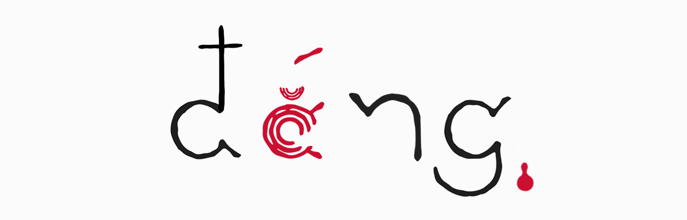

  

  <h1>NGUYEN VIET LINH</h1>

  

    Building intelligent products where AI, engineering, and design come together.
  

  

    
    
    
    
  

## About

I'm a product-minded developer based in Hanoi, Vietnam, focused on building practical AI
systems and polished full-stack products. I work across research, backend architecture,
interfaces, and deployment, with a particular interest in agentic workflows, developer
tools, and real-time applications.

I enjoy taking ideas from early experiments to usable products. My goal is to make
technically ambitious software clear, reliable, and genuinely helpful to the people using
it. I care about both how a system works and how it feels, because good engineering and
thoughtful design should strengthen each other.

## Achievements

- **2nd Prize in Student Scientific Research, HaUI (2024 to 2025):** Research project
  “Bitter”.
- **Top 30, Google Hackathon (2026):** Built InterviewX, a real-time AI mock interviewer
  using Gemini, LiveKit, FastAPI, and Next.js.

## Selected work

- **[AiSee](https://github.com/vietlinhh02/aiseeapp):** Assistive AI platform for people
  with visual impairments, including calls, messaging, reminders, and voice assistance.
  The mobile app and [Go backend](https://github.com/vietlinhh02/aiseebackend) work as one
  product. `Flutter` `Dart` `Go` `PostgreSQL`

- **[C2 App 053](https://github.com/AI20K-Build-Cohort-2/C2-App-053):** AI-powered
  literature review workspace for searching, organizing, and analyzing research papers.
  `Python` `TypeScript` `React` `FastAPI` `PostgreSQL`

- **[atripsme](https://github.com/vietlinhh02/atrips.com):** Conversational AI travel
  planning, collaboration, and itinerary sharing. [Live site](https://ai.visme.tech)
  `TypeScript` `Next.js` `FastAPI` `PostgreSQL`

- **[ITVX](https://github.com/vietlinhh02/itvx):** AI recruiting for JD analysis, CV
  screening, and real-time interviews. `Python` `Next.js` `LiveKit` `Gemini`

## Toolbox

  
  

## GitHub activity

<picture>
  <source
    media="(prefers-color-scheme: dark)"
    srcset="https://github-readme-activity-graph.vercel.app/graph?username=vietlinhh02&theme=github-compact&hide_border=true"
  />
  <source
    media="(prefers-color-scheme: light)"
    srcset="https://github-readme-activity-graph.vercel.app/graph?username=vietlinhh02&theme=github-light&hide_border=true"
  />
  
</picture>

  Make useful things. Make them feel good to use.

